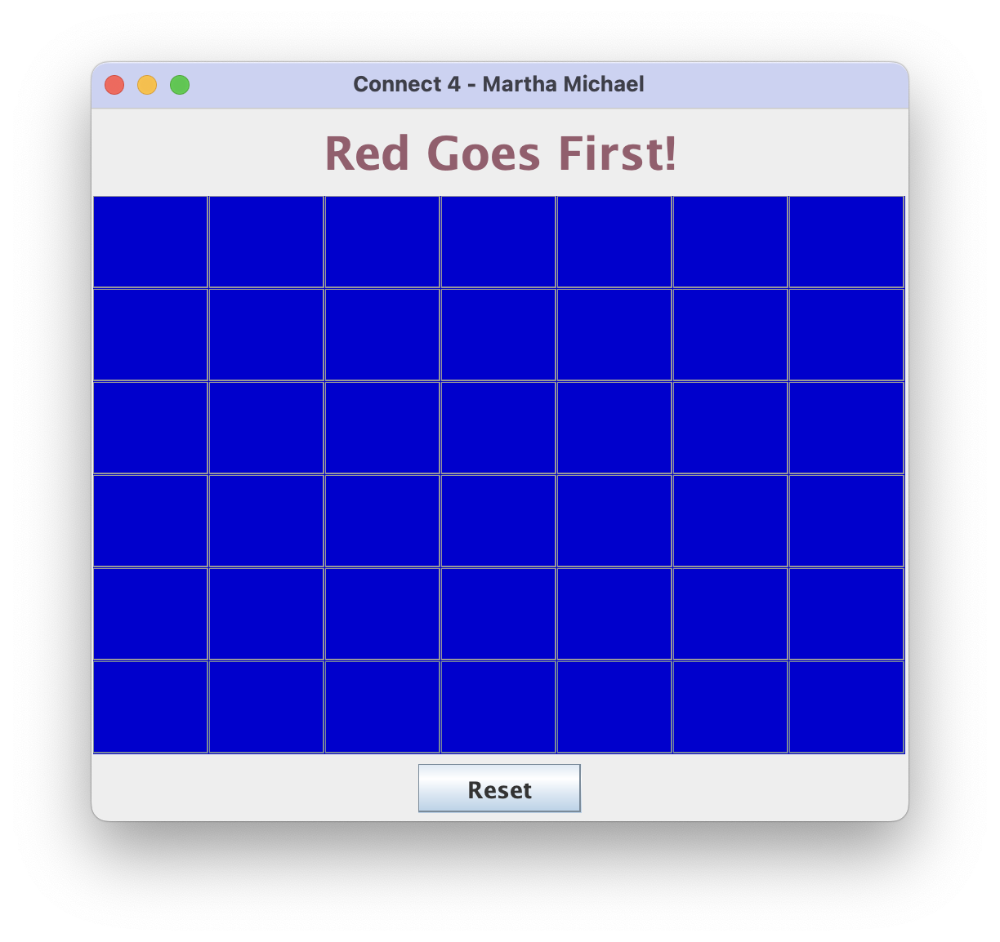

# connect4
A classic Connect 4 game implemented in Java using Swing GUI components. Features include interactive gameplay with visual feedback, hover effects, and win detection logic.

## Screenshot


## How to Play

1. Players take turns dropping colored discs into columns
2. Red player goes first, followed by Yellow
3. The first player to connect 4 of their discs horizontally, vertically, or diagonally wins
4. If the grid fills up without a winner, the game is a draw

## Setup and Installation

### Prerequisites
- Java Development Kit (JDK) 8 or higher

### Running the Game

#### Option 1: From the Command Line
1. Clone this repository:

```bash
git clone https://github.com/martha-michael/connect4.git
cd connect4
```

2. Compile the Java files:

```bash
javac src/connect4/*.java src/connect4/ui/*.java 
```

3. Run the game:

```bash
java -cp src connect4.Connect4App
```

## License

This project is licensed under the MIT License - see the LICENSE file for details.
